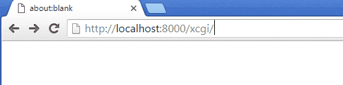

# xCGI tool
This is small AJAX script, which allows you to run CGI-scripts and fetch results
via AJAX request.
## Usage
Add xcgi.js to your HTML page

`<!-- XCGI BEGIN -->`

``

`<!-- XCGI END -->`

After this, add a div with some unique id.
In div make a js call to xcgi function.

It takes few arguments - id of your element to write to and actual url to make AJAX call. In our case - just a relative url to CGI script.

On success, contents of your div will be
overwritten with data, returned by your CGI script.

`
`

  ``

   `Loading... `

   `
`

 In your CGI script you should do whatever you want, but return data as plain text.
 See *example* folder for sample working script.

 ## Running the bundled example

 * Copy example.cgi to your cgi-bin, adjust your Perl interpreter and set correct permissions.
 * Copy index.html to your document root
 * Create folder "js" and put xcgi.js here
 * Adjust index.html with actual locations of JS and CGI
 * Now open location of index.html in browser

You should get someting like this (gif is animated)::

##  Real-life Usage
This tool did some good job for me in good old times to create dynamic site content - e.g. fetch ads, rss headers, etc. Some stuff was located on different domain, so  this was about cross-domain scripting.
**Be careful.**

May be it makes sense to utilize jQuery and other bells-n-whistles, but this one is pretty minimal and does the job.
